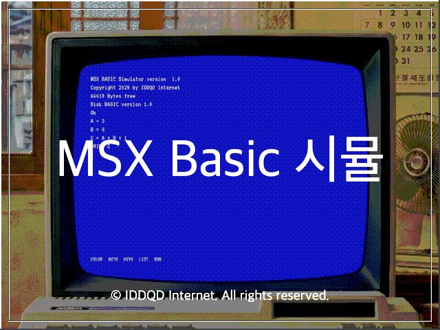

# MSX BASIC 웹 시뮬레이터



**MSX BASIC Web**은 웹 브라우저에서 추억의 MSX BASIC을 경험할 수 있는 시뮬레이터입니다. 레트로한 모니터 인터페이스와 함께 BASIC 프로그래밍을 학습하고 실행해 보세요.

## ✨ 주요 특징

이 프로젝트는 다음과 같은 철학으로 개발되었습니다:

- **서버 데이터 전송 없음**: 모든 코드는 사용자의 브라우저 내에서만 실행되며, 서버로 그 어떤 데이터도 전송되지 않습니다.
- **설치 불필요**: 복잡한 에뮬레이터 설정이나 설치 없이 웹 접속만으로 바로 실행됩니다.
- **로그인 불필요**: 회원가입이나 로그인 절차 없이 즉시 사용 가능합니다.
- **브라우저 저장소 사용**: `SAVE` 명령어로 저장한 코드는 브라우저의 `localStorage`에 안전하게 보관됩니다. (캐시나 데이터를 지우면 사라질 수 있습니다)

## 🕹️ 지원 명령어

MSX BASIC의 핵심 명령어들을 지원합니다:

- **시스템**: `RUN`, `LIST`, `NEW`, `CLS`
- **저장/관리**: `SAVE "제목"`, `LOAD "제목"`, `FILES` (브라우저 로컬 저장)
- **출력**: `PRINT` (단축키 `?`)
- **제어문**: `GOTO`, `GOSUB` ... `RETURN`, `IF` ... `THEN`, `FOR` ... `NEXT`, `END`
- **입력**: `INPUT`
- **변수**: 숫자형 및 문자열(`$`) 변수 지원

## 🚀 사용 모드

1. **직접 모드 (Direct Mode)**:
   - 줄 번호 없이 명령어를 입력하면 즉시 실행됩니다.
   - 예: `PRINT 10 * 20` 입력 후 엔터 → `200` 출력

2. **프로그램 모드 (Program Mode)**:
   - 줄 번호와 함께 코드를 작성하면 메모리에 저장됩니다.
   - `RUN`을 입력하면 저장된 프로그램이 실행됩니다.
   - `LIST`를 입력하면 현재 작성된 코드를 볼 수 있습니다.

## 📝 예제 코드

**구구단 출력**
```basic
10 INPUT "몇 단?: "; D
20 FOR I = 1 TO 9
30 PRINT D; " * "; I; " = "; D*I
40 NEXT I
RUN
```

**숫자 맞추기 게임**
```basic
10 N = 7
20 INPUT "숫자(1-10): "; G
30 IF G = N THEN GOTO 60
40 IF G < N THEN PRINT "더 큰 수입니다"
50 IF G > N THEN PRINT "더 작은 수입니다"
55 GOTO 20
60 PRINT "정답입니다!"
```

## 🛠️ 기술 스택

- **HTML5 & CSS3**: 화면 레이아웃 및 CRT 모니터 효과 구현
- **Vanilla JavaScript**: 인터프리터 로직 자체 구현 (외부 라이브러리 없음)

## 📄 라이선스

자유롭게 사용하고 공부 용도로 활용하세요.
